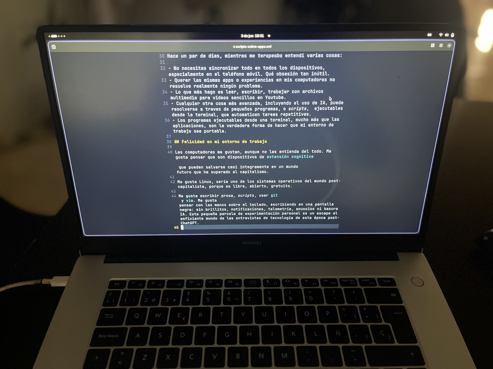

Estoy escribiendo esto desde una vieja Huawei Matebook. Recientemente instalé [Fedora Linux](https://fedoraproject.org/) (mi distro favorita) en ella [^1]. Durante el año pasado y buena parte de este, estuve usando una Macbook Air M1 como computadora diaria. Volví a Linux como una terapia.

[^1]: Soy un nerd de [Linux](https://es.wikipedia.org/wiki/GNU/Linux), pero no tan nerd para tener [Arch Hyprland](https://wiki-archlinux-org.translate.goog/title/Hyprland) y pasar mil horas configurando archivos para tener un Pokémon en la terminal. No soy ni tan técnico ni tan ocioso.

## Linux como terapia

Recientemente tuve una desastrosa entrevista de trabajo, donde solicité ser *Product Manager*[^2]. Parece que no logro pasar un tipo de entrevista «técnica» conocida como *Product Sense Interview*. La idea es responder a una pregunta del tipo: ¿Cómo mejorías una aplicación como AirBnB?, o bien ¿Cómo mejorarías la experiencia de compra para una pequeña cadena de tiendas locales? Preguntas suficientemente ambiguas para que tú las conviertas en retos específicos, para usuarios específicos, con métricas de éxito e ideas de funcionalidades que se hilen con lógica y consistencia. En la práctica, ese era mi día a día durante siete años; pero en la entrevista, simplemente no puedo hilar nada coherente.

[^2]: Este es el puesto que, durante siete años, ocupé en una *startup*, incluso antes de comenzar a estudiar el doctorado en antropología. 

No importan mucho los detalles de la entrevista, es cuestión de practicar para ese tipo de prueba, como sucede con cualquier otro tipo de prueba, profesional o académica. Pero la sensación de fracaso, de ser un fraude, es difícil de quitar.

Linux siempre ha sido el sistema operativo que he querido usar en mi día a día. El problema es que no soy tan técnico y Linux a veces da un trabajo horrible, es brutalmente frustrante cuando te atoras en algo que no sabes cómo resolver, o que no tienes un mes para investigar.

Pero ahora, tras sentirme atascado, simplemente sentí que era el momento de volver a algo que sea libre, que sea mío, que, tal vez, aunque con dificultad, pueda controlar.

## Scripts, no apps

Muchos de los problemas que me ha dado Linux son porque no es compatible con cosas en Windows o en Mac. Yo quiero poder abrir una computadora y hacer mis cosas, que el sistema se haga a un lado. Si debo trabajar con Mac a veces pero volver a Linux, no tener que pasar por el trabajo cognitivo de adaptarme a ambientes completamente diferentes.

Hace un par de días, mientras me *terapeaba* entendí varias cosas:

- No necesitas sincronizar todo en todos los dispositivos, especialmente en el teléfono móvil. Qué obsesión tan inútil.
- Querer las mismas apps o experiencias en mis computadoras no resuelve realmente ningún problema.
- Lo que más hago es leer, escribir, trabajar con archivos multimedia para videos sencillos en Youtube.
- Cualquier otra cosa más avanzada, incluyendo el uso de IA, puede resolverse a traves de pequeños programas, o *scripts*,  ejecutables desde la terminal, que automaticen tareas repetitivas.
- Los programas ejecutables desde una terminal, mucho más que las aplicaciones, son la verdadera forma de hacer que mi entorno de trabajo sea portable.

## Felicidad en mi entorno de trabajo

Las computadoras me gustan, aunque no las entienda del todo. Me gusta pensar que son dispositivos de [extensión cognitiva](https://www.scielo.org.mx/scielo.php?script=sci_arttext&pid=S0185-24502014000100011) que pueden salvarse casi íntegramente en un mundo futuro que ha superado al capitalismo.

Me gusta Linux, sería uno de los sistemas operativos del mundo post-capitalista, porque es libre, abierto, gratuito.

Me gusta escribir prosa, *scripts*, usar [git](https://es.wikipedia.org/wiki/Git) y [vim](https://es.wikipedia.org/wiki/Vim). Me gusta pensar con las manos sobre el teclado, escribiendo en una pantalla negra: sin brillitos, notificaciones, telemetría, anuncios ni basura IA. Esta pequeña parcela de experimentación personal es un escape al asfixiante mundo de las entrevistas de tecnología de esta época post-ChatGPT.

